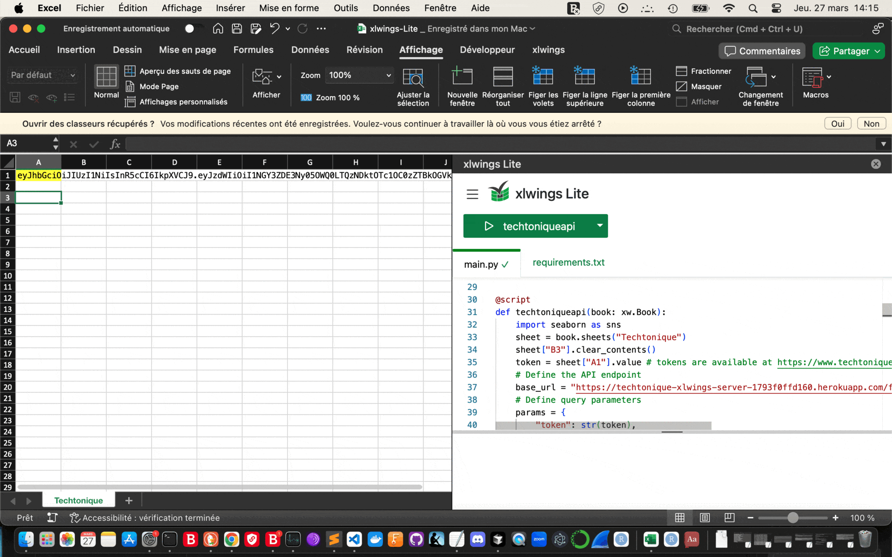

# Excel Files for calling [Techtonique API](https://www.techtonique.net/about)

These files are templates for calling [Techtonique's API](https://www.techtonique.net/howtoapi) from Excel. 

- `demo.xlsm` relies on an [xlwings server](https://server.xlwings.org/en/latest/) located at [https://techtonique-xlwings-server-1793f0ffd160.herokuapp.com/](https://techtonique-xlwings-server-1793f0ffd160.herokuapp.com/)
- `VBA-Web.xlsm` relies on [VBA-Web](https://github.com/VBA-tools/VBA-Web)

